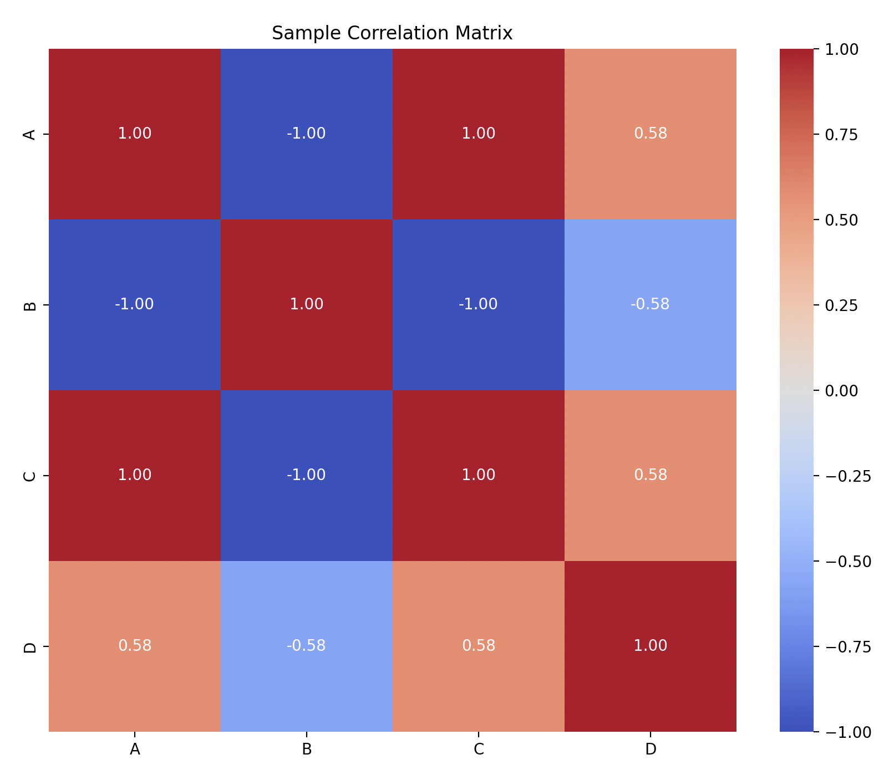
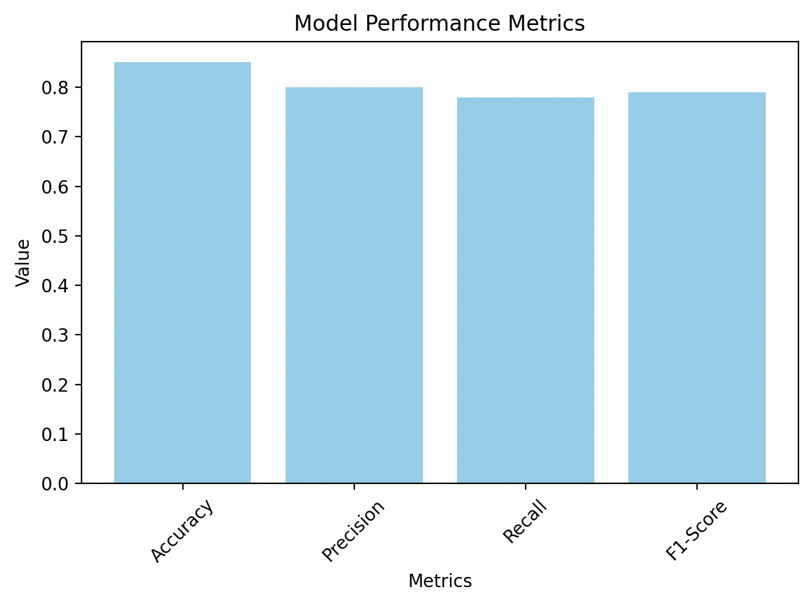

# CS 498 E2E Final Project (sp24)
This project was developed by me as a final project for CS 498: End-to-End Data science at UIUC for the Spring 2024 semester.

# Statement of Purpose 
In today's era of machine learning, natural language processing, automation, and analytics, statistics plays an important role across multiple domains. Statisticians often handle complex datasets and rely heavily on computational tools for their analysis. This package is designed as a comprehensive toolkit, streamlining the coding process for statisticians. Instead of juggling multiple packages for various hypothesis tests or writing extensive code for data cleaning and preprocessing, this package consolidates these capabilities into one, allowing users to efficiently conduct goodness-of-fit testing, ANOVA analysis, data imputation, summary statistics reporting, and more.
# Context of the package
As outlined in the purpose statement, this package aims to simplify statistical analysis by serving as a versatile toolkit for statisticians. While many tools and programming languages are available for tasks like hypothesis testing, data visualization, preprocessing, etc. this package consolidates these methods into one convenient solution. It offers a unified resource, reducing the need to switch between multiple imports, packages, or languages. By centralizing these tools, the package provides a smoother coding experience, more readable code, and easier debugging by using a single toolkit for multiple statistical tasks.
# Setup instructions
Upon using ``git clone`` to clone the repository please make sure that the following are present:
- ``pyproject.toml``
- ``src/stattools/__init__.py``
- ``.gitignore``
- ``.python-version`` with the version as 3.11.8

The initial directory set up should look as follows when cloned:
```
./sp24_cs498e2e-final_rgoenka2/
    - src/
        - stattools/
            - __init__.py
            - data_processing.py
            - eda,py
            - predictive_modeling.py
            - stat_tests.py
            - visual.py
    - tests/
        - test_eda.py
        - test_model.py
        - test_processing.py
        - test_stat_tests.py
        - test_visual.py
- _quarto.yml
- .gitignore
- .python-version
- example_corr_mat_from_code.png
- example_mpp_from_code.png
- index.qmd
- pyproject.toml
- README.md
```

(Note: the ``.png`` files are ONLY to show the outputted plots in the README file).

Once these checks have been made, install Rye on your local machine if not already present. Checkout [this](https://rye-up.com/) guide from Rye on how to install it on your operating system. If running ``rye`` in the terminal yeilds an error you might want to try ``source "$HOME/.rye/env"`` first. Once this is done please follow these steps:

- Run ``rye sync`` and check if it create ``.venv/``, ``requirements-dev.lock``, ``requirements.lock``. 

- Please enter the virtual environment. If unsure on how to do so you may try ``source /Users/ram/Desktop/sp24_cs498e2e-final_rgoenka2/.venv/bin/activate`` (please make sure to replace ``ram`` with the relevant name/directory and ``Desktop`` with the location of the folder if not``Desktop``. Alternatively you can close and re-open a new terminal and it should push you into the virtual environment. 

- Run ``rye build`` once in the virtual environment and verify the creation of ``dist/stattools-0.1.0-py3-none-any.whl`` and ``dist/stattools-0.1.0.tar.gz``. 

- Run ``rye test`` to run the test cases. If everything goes correctly there should be 13 tests that pass. There might be a warning displayed but that can be ignored. The tests might take about 30 - 45 seconds to run.

- Run ``rye run quartodoc build`` and make sure that it creates the ``references/`` folder. If you do not have quarto installed on your local machine, please checkout the installation steps [here](https://quarto.org/docs/download/).

- Run ``quarto preview`` and make sure it creates the ``docs/`` folder.

- The above step should lead you to the API documentation of the package. 

Some usage examples of the package from the command line are presented below. 

# Usage examples

Below are the usage examples (with output) for every function from each of the modules. 

The first step is to make sure you type ``python`` in the terminal/command line. Only after this step will the functions be usable from the terminal. Please use the set up instructions (or read the relevant file from the source folder to learn about each of the functions). Please note that any additional imports in the below examples (``numpy``, ``pandas``) were made only for the purposes of generating some example data for the functions to perform their respective task on.
## ``data_processing``

``encode_categorical``

```python
>>> import pandas as pd
>>> from stattools.data_processing import encode_categorical
>>> data = {'color': ['red', 'blue', 'green', 'red', 'blue', 'green']}
>>> df = pd.DataFrame(data)
>>> encoded_df = encode_categorical(df, 'color', method='onehot')
>>> print(encoded_df)
   color_blue  color_green  color_red
0       False        False       True
1        True        False      False
2       False         True      False
3       False        False       True
4        True        False      False
5       False         True      False
```

``impute_vals``

```python
>>> import numpy as np
>>> from stattools.data_processing import impute_vals
>>> data = np.array([[1, 2, np.nan], [4, np.nan, 6], [7, 8, 9]])
>>> imputed_data = impute_vals(data, strategy='mean')
>>> print(imputed_data)
[[1.  2.  7.5]
 [4.  5.  6. ]
 [7.  8.  9. ]]
```

``log_transform``

```python
>>> import pandas as pd
>>> from stattools.data_processing import log_transform
>>> data = {'price': [10, 100, 1000, 5000, 2000]}
>>> df = pd.DataFrame(data)
>>> log_transformed = log_transform(df, 'price')
>>> print(log_transformed)
0    2.397895
1    4.615121
2    6.908755
3    8.517393
4    7.601402
Name: price, dtype: float64
```

``binning_features``

```python
>>> from stattools.data_processing import binning_features
>>> data = {'age': [5, 15, 25, 35, 45, 55, 65, 75, 85]}
>>> df = pd.DataFrame(data)
>>> bins = 3
>>> labels = ['Young', 'Middle-aged', 'Senior']
>>> binned_df = binning_features(df, 'age', bins, labels, strategy='quantile')
>>> print(binned_df)
   age   age_binned
0    5        Young
1   15        Young
2   25        Young
3   35  Middle-aged
4   45  Middle-aged
5   55  Middle-aged
6   65       Senior
7   75       Senior
8   85       Senior
```

## ``eda``

``summary_statistics``

```python
>>> import pandas as pd
>>> from stattools.eda import summary_statistics
>>> data = {
...     'age': [25, 30, 35, 40, 45, 50, 55, 60],
...     'income': [30000, 35000, 40000, 45000, 50000, 55000, 60000, 65000],
...     'experience': [1, 5, 10, 15, 20, 25, 30, 35]
... }
>>> df = pd.DataFrame(data)
>>> summary = summary_statistics(df)
>>> print(summary)
            count       mean           std      min       25%      50%       75%      max   mode
age           8.0     42.500     12.247449     25.0     33.75     42.5     51.25     60.0     25
income        8.0  47500.000  12247.448714  30000.0  38750.00  47500.0  56250.00  65000.0  30000
experience    8.0     17.625     12.046784      1.0      8.75     17.5     26.25     35.0      1
```

## ``predictive_modeling``

``LogisticRegression``

```python
>>> from stattools.predictive_modeling import LogisticRegression
>>> import numpy as np
>>> np.random.seed(42)
>>> X = np.random.randn(200, 4)
>>> y = (X[:, 0] + X[:, 1] > 0).astype(int)  
>>> logreg = LogisticRegression()
>>> X_train, X_test, y_train, y_test = logreg.split_data(X, y)
>>> logreg.fit(X_train, y_train)
>>> predictions = logreg.predict(X_test)
>>> accuracy = (predictions == y_test).mean()
>>> print(f"Logistic Regression Accuracy: {accuracy:.2f}")
Logistic Regression Accuracy: 0.95
```

## ``stat_tests``

``t_test``

```python
>>> import numpy as np
>>> from stattools.stat_tests import t_test
>>> group1 = np.array([12.5, 13.1, 14.2, 14.8, 15.6])
>>> group2 = np.array([11.9, 13.4, 13.8, 14.0, 14.5])
>>> t_stat, p_value = t_test(group1, group2)
>>> print(f"T-statistic: {t_stat}, P-value: {p_value}")
T-statistic: 0.7281456436945619, P-value: 0.48728737969274993
```

``chi_sq``

```python
import numpy as np
>>> from stattools.stat_tests import chi_sq
>>> observed = np.array([50, 30, 20])
>>> expected = np.array([40, 35, 25])
>>> chi_square_stat, p_value = chi_sq(observed, expected)
>>> print(f"Chi-Square Statistic: {chi_square_stat}, P-value: {p_value}")
Chi-Square Statistic: 4.214285714285714, P-value: 0.117
```

``anova``

```python
import numpy as np
>>> from stattools.stat_tests import anova
>>> group1 = np.array([5.1, 5.5, 5.9, 6.0, 6.1])
>>> group2 = np.array([6.2, 6.5, 6.8, 7.0, 7.1])
>>> group3 = np.array([7.2, 7.5, 7.8, 8.0, 8.1])
>>> F_stat, p_value = anova(group1, group2, group3)
>>> print(f"F-statistic: {F_stat}, P-value: {p_value}")
F-statistic: 33.632286995515706, P-value: 1.2039617712789052e-05
```

``pearson_corr``

```python
import numpy as np
>>> from stattools.stat_tests import pearson_corr
>>> x = np.array([1, 2, 3, 4, 5, 6])
>>> y = np.array([2, 4, 6, 8, 10, 12])
>>> correlation_coeff = pearson_corr(x, y)
>>> print(f"Pearson Correlation Coefficient: {correlation_coeff}")
Pearson Correlation Coefficient: 0.8333333333333333
```

## ``visual``

``corr_mat``

```python
>>> import pandas as pd
>>> from stattools.visual import corr_mat
>>> data = pd.DataFrame({
...     'A': [1, 2, 3, 4, 5, 6],
...     'B': [6, 5, 4, 3, 2, 1],
...     'C': [2, 4, 6, 8, 10, 12],
...     'D': [5, 3, 4, 2, 7, 8]
... })
>>> corr_mat(data, title="Sample Correlation Matrix")
```


``mpp``

```python
>>> from stattools.visual import mpp
>>> performance = {
...     'Accuracy': 0.85,
...     'Precision': 0.80,
...     'Recall': 0.78,
...     'F1-Score': 0.79
... }
>>> mpp(performance, title="Model Performance Metrics", kind='bar')
```

